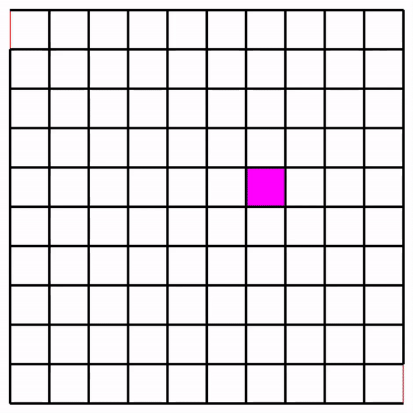
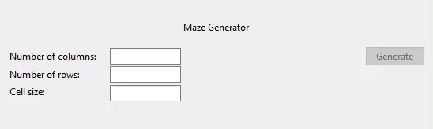
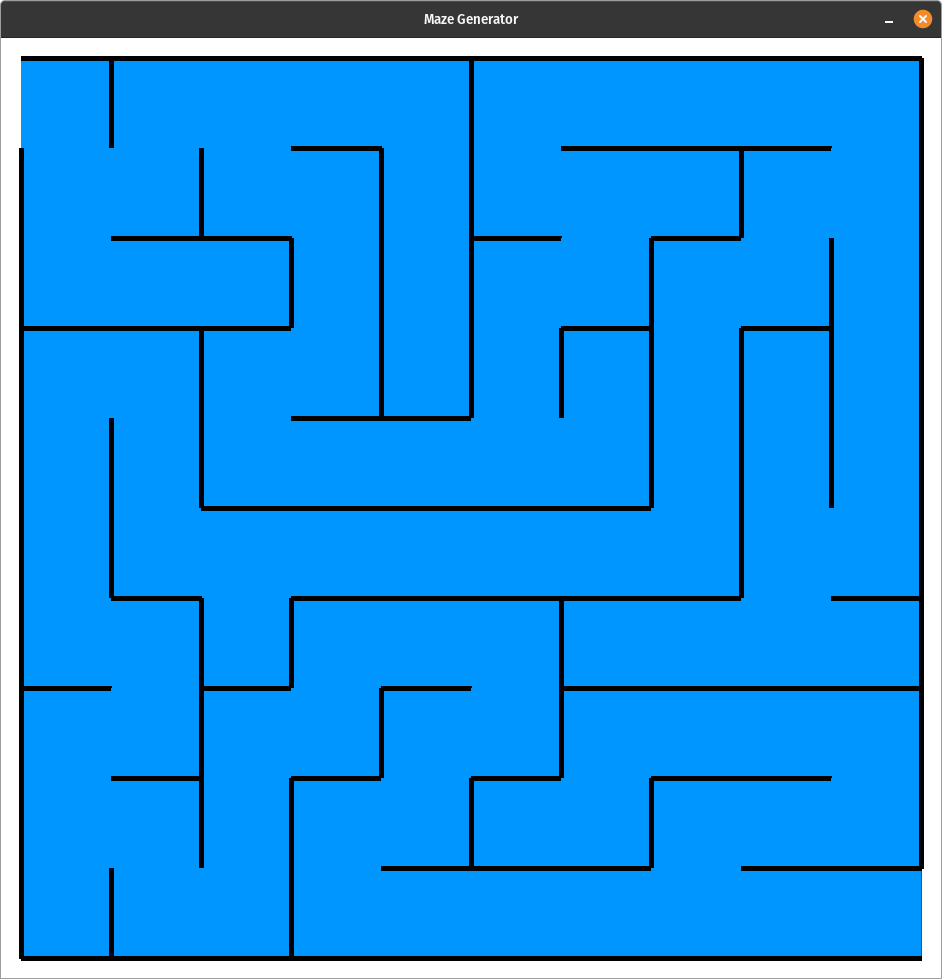
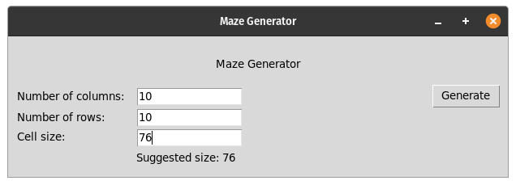
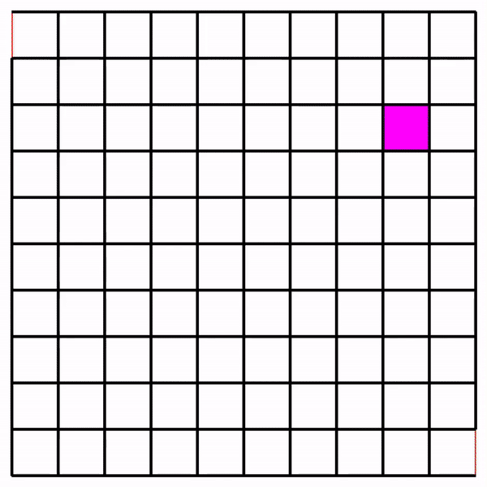
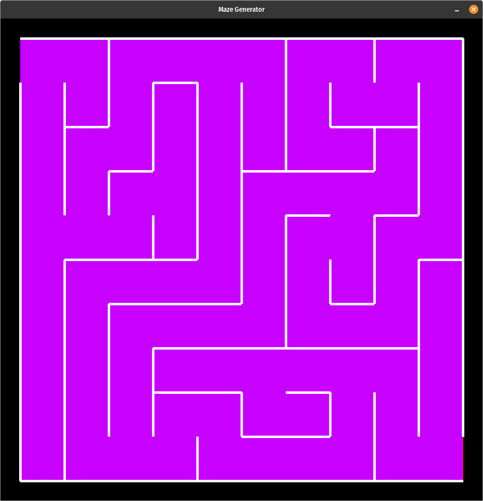
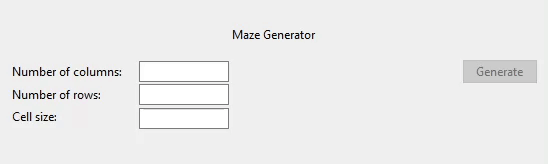

# Introduction


Maze Generator is a program that automates the creation of mazes. It uses the randomized depth-first search algorithm, also known as recursive backtracker, in order to generate mazes. The user is able to customize the number of rows and colums of the maze and its size upon creation via a Graphical User Interface.

# Index
- [About](#About)
- [Usage](#Usage)
    - [Dependencies](##Dependencies)
    - [Installation](##Installation)
- [Resources](#Resources)
- [Gallery](#Gallery)

# About
Generating a maze given a 2-dimensional arrangement of cells can be thought of as disabling the walls between cells in such a way that it creates some sort of path. Randomizing walls removal in such a way that it creates a path from a starting cell to a goal cell is the objective of a depth-first search algorithm.

The stack, an abstract data type, results in being ideal for this type of algorithm; it consists of serving as a collection of elements, with two primary operations, such as push, which appends a new element to the stack, and pop, which removes the most recently added element.

Starting from an initial cell, the generator randomly selects the next cell to go to that hasn't been visited. The generator then proceeds to remove the walls between these two cells, and moves to the next cell at hand. As the generator keeps moving from cell to cell, new cells are added to the stack. If the generator reaches a cell that has no unvisited neighbors, the generator backtracks, popping cells from the stack and moving to the new last cell in the stack.

The generator continues this process until every cell has been visited, and by the way that the stack works, the generator will backtrack all the way back to the starting cell, since that was the very first cell added to the stack. This ensures that all cells are visited and that the generator won't get stuck in a dead-end.

# Usage
In order to run the program, download the repository into any given directory. Once downloaded, navigate inside the repository from the terminal. Finally, assuming all dependencies are installed, running the `run.py` file or executing the following command will start the program:
```
python run.py
```
A Graphical User Interface (GUI) will appear, in which the numbers of columns and rows of the maze can be specified, along with an entry to specify the cell size throughout the maze.

<p align="center">
  
</p>

Once all three fields have been completed without any validation conflicts, clicking on the `Generate` button will display the maze as its generation begins, and thus, the recursive-backtracking algorithm can be seen at work until the maze is fully complete.

## Dependencies
- `Pygame`

## Installation
In order to successfully run the program though, the library `Pygame` must be installed. Any version of Python from 3.1 to 3.7 should be installed, as to avoid any compatibility issues.

In order to not pollute the local Python installation with third-party libraries, a virtual environment can be created in which third-party libraries (such as `Pygame`) can be installed without altering the local Python installation environment.

In order to create a virtual environment, navigate to the project root directory and enter the following command (on a Unix-based system):
```
python3 -m venv .venv
```
where `.venv` is the virtual environment directory name.

On Windows, the command remains all the same except that `python3` should be replaced with just `python`.

Now that the virtual environment has been created, it must be activated. On a Unix-based system, the following command will activate the virtual environment:
```
source ./.venv/bin/activate
```
On Windows, the `activate` script must be ran, depending on the shell used. For instance, from Powershell, the following commands will activate the virtual environment,
```
.\.venv\Scripts\Activate.ps1
```
or
```
.\.venv\Scripts\activate
```
recalling that `.venv` is the name of the virtual environment, and if a different name should be specified, the aforementioned commands must accommodate said name.

Once activated, you should be able to see that the name of the virtual environment's directory gets displayed at the beginning of the command line prompt. Now, third-party libraries can be installed in the virtual environment. In order to install the necessary libraries to run the program (those specified in the `requirements.txt` file), type:
```
pip install -r requirements.txt
```
in the command line, which should work on both Unix-based systems and on Windows.

Alternatively, since only one third-party library is used for the project (the fabled `Pygame` library), installing directly by typing:
```
pip install pygame
```
will be enough to run the program with all required dependencies.

# Resources
- [Maze Generation algorithm](https://en.wikipedia.org/wiki/Maze_generation_algorithm) (Wikipedia)
- [Maze Generator with p5.js](https://thecodingtrain.com/CodingChallenges/010.1-maze-dfs-p5.html) (The Coding Train)

# Gallery









